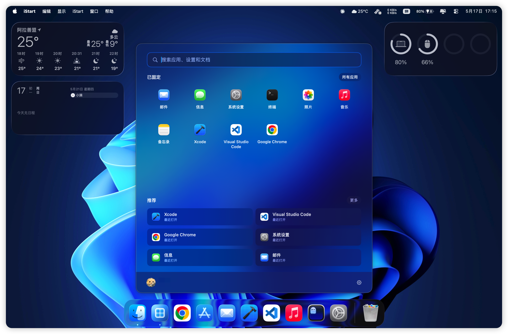

<h1 align="center">iStart</h1>

  <strong>一个为 macOS 打造的轻量级开始菜单与应用启动器。</strong>

  
  
  

  <a href="#特性">特性</a>
  ·
  <a href="#安装">安装</a>
  ·
  <a href="#使用">使用</a>
  ·
  <a href="#开发">开发</a>

---

iStart 把熟悉的“开始菜单”体验带到 macOS：按下全局快捷键，搜索应用、启动应用、固定常用应用，或快速回到最近打开过的应用。它使用 SwiftUI 和 AppKit 构建，保持原生、轻量、可键盘操作。

## 特性

- **全局快捷键**：支持 `Command Space`、`Option Space`、`Control Space`、`Command Option Space` 唤起菜单。
- **快速应用搜索**：按应用名、Bundle ID、首字母和拼音友好的匹配方式查找应用。
- **固定应用**：把常用应用固定到开始菜单网格，并支持拖拽排序。
- **最近打开**：自动记录最近启动的应用，方便快速回到工作流。
- **所有应用**：浏览已索引的全部 macOS 应用。
- **自定义索引目录**：添加额外应用文件夹，适合索引用户目录应用和 Chrome PWA 快捷方式。
- **开机启动**：支持注册为 macOS 登录项，在后台保持可用。
- **原生体验**：SwiftUI + AppKit 浮动面板、毛玻璃材质、键盘导航、中英文界面。

## 安装

1. 前往 [Releases](https://github.com/Pylogmon/iStart/releases) 页面下载最新的 `iStart.zip` 安装包。

## 使用

- 按配置好的全局快捷键显示或隐藏 iStart。
- 直接输入关键词搜索应用。
- 按 `Enter` 打开当前选中的搜索结果。
- 使用 `Up` / `Down` 在搜索结果中移动。
- 按 `Esc` 或点击窗口外侧关闭菜单。
- 使用 pin 按钮固定或取消固定应用。
- 在 **Settings > Applications** 中添加额外应用目录或重建索引。

如果 `Command Space` 仍被 Spotlight 占用，请先到系统设置中关闭或修改 Spotlight 快捷键，避免快捷键冲突。

## 开发

### 环境要求

- macOS 26.0 或更高版本
- 支持 macOS 26 SDK 的 Xcode
- Swift 5
